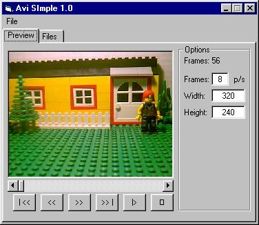



## Avi Simple

### Description

Creates avi files from a series of images (bmp, gif, jpg). I started making stop motion animation with legos and needed a way to create the avi file, so here it is. It doesn't save audio just video, if anyone can add audio, do it and upload it here. Credit: Ray Mercer created the avi module and cDib class file.
 
### More Info
 

             |
---                |---
**Submitted On**   |2002-07-26 14:44:08
**By**             |[DoWnLoHo](https://github.com/Planet-Source-Code/PSCIndex/blob/master/ByAuthor/downloho.md)
**Level**          |Intermediate
**User Rating**    |5.0 (65 globes from 13 users)
**Compatibility**  |VB 6\.0
**Category**       |[Graphics](https://github.com/Planet-Source-Code/PSCIndex/blob/master/ByCategory/graphics__1-46.md)
**World**          |[Visual Basic](https://github.com/Planet-Source-Code/PSCIndex/blob/master/ByWorld/visual-basic.md)
**Archive File**   |[Avi\_Simple1111137262002\.zip](https://github.com/Planet-Source-Code/downloho-avi-simple__1-37281/archive/master.zip)

